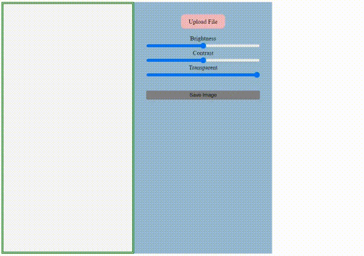

# Project: Hypergram (Frontend) - Hyperskills

# Hypergram: Image Manipulation Tool
Hypergram is a web-based application designed for simple and efficient image manipulation. It allows users to upload an image, adjust its brightness, contrast, and transparency, and then save the modified image. This tool is particularly useful for basic image editing tasks without the need for complex software.

## Features
* Image Upload: Users can upload an image file directly from their device.
* Brightness Adjustment: Allows users to adjust the brightness of the uploaded image.
* Contrast Adjustment: Offers the ability to modify the contrast of the image.
* Transparency Adjustment: Provides a slider to adjust the transparency of the image.
* Save Image: Users can save the modified image in PNG format.

## Installation
Hypergram is a web-based application and does not require installation. Simply open the provided HTML file in a web browser to start using the application.

## Contributing
Contributions to improve the functionality or user interface of Hypergram are welcome. Please feel free to submit pull requests or open issues on GitHub.
 
)

#### Notes:
* _This project is tagged as Hard in hyperskills._
* Got to use: 
  * addEventListener, getElementById, getContext
  * readAsDataURL, drawImage, getImageData, putImageData
  * Plus alot more
* 
###### Assignment Links
[Hypergram)](https://hyperskill.org/projects/199?track=5)
